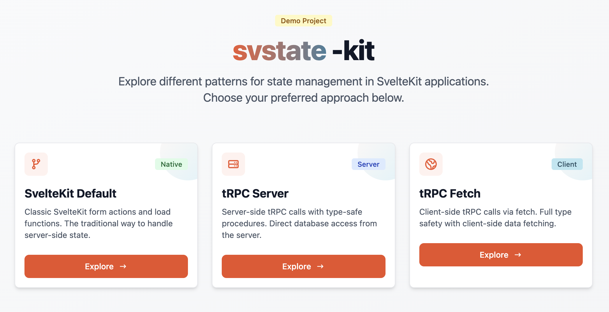

# svstate-kit

**Effortless state management for SvelteKit applications.**



## Why svstate?

Stop wrestling with complex state management. **svstate** gives you reactive, type-safe state that just works.

- **Zero boilerplate** — Wrap your data and go
- **Automatic reactivity** — Changes propagate instantly
- **Built-in side effects** — Computed values update automatically
- **Type-safe** — Full TypeScript support out of the box

## See It In Action

This demo showcases three ways to manage state in SvelteKit:

| Approach             | Best For                     |
| -------------------- | ---------------------------- |
| **SvelteKit Native** | Traditional form-based apps  |
| **tRPC Server**      | Server-rendered pages        |
| **tRPC + svstate**   | Interactive client-side apps |

## Quick Start

```bash
npm install svstate
```

```typescript
import { createSvState } from 'svstate';

const state = createSvState(myData, {
	effect: ({ target }) => recalculate(target),
	action: async () => await saveToServer(state.data)
});
```

That's it. Your state is now reactive, tracked, and ready to save.

## Learn More

- [svstate on npm](https://www.npmjs.com/package/svstate)
- [Live Demo](https://svstate-kit.example.com)

---

Built with SvelteKit, tRPC, and Tailwind CSS.
