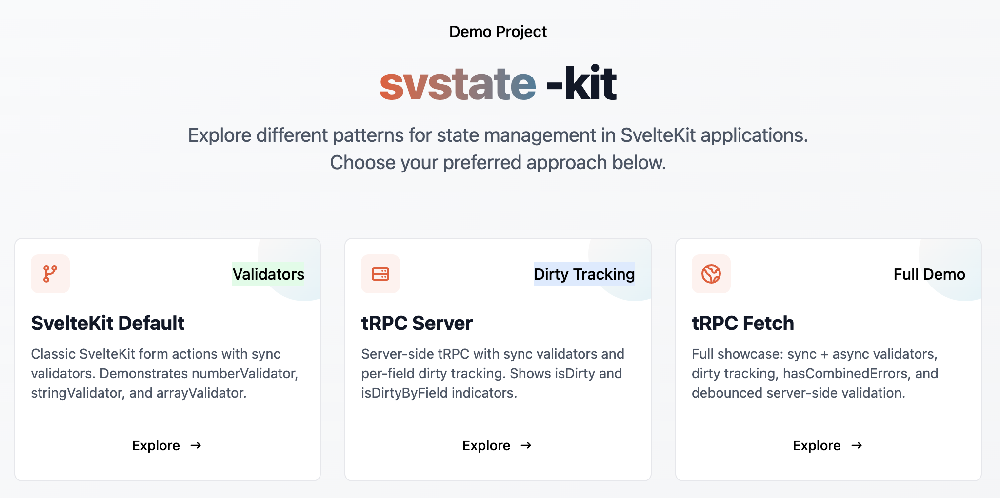

# svstate-kit

**Demo project for the [svstate](https://www.npmjs.com/package/svstate) npm package** — a reactive state management library for Svelte 5 with built-in validation, dirty tracking, async validators, and a plugin system.



## Overview

This companion application demonstrates how `svstate` integrates with SvelteKit across three progressively richer patterns. Each demo solves the same problem — editing an order form — using a different approach, so you can compare the patterns side by side and pick what fits your project.

| Pattern              | Route             | Features                                       |
| -------------------- | ----------------- | ---------------------------------------------- |
| **SvelteKit Native** | `/ui/kit`         | Form actions, sync validation                  |
| **tRPC Server**      | `/ui/trpc-server` | Server-side tRPC, dirty tracking, action state |
| **tRPC + svstate**   | `/ui/trpc-fetch`  | Async validation, plugins, persist, undo/redo  |

---

## Getting Started

Requires **Node.js >= 22**.

```bash
npm install
npm run dev
```

Open [http://localhost:5173](http://localhost:5173) to see the demo selector.

### Other commands

```bash
npm run build        # Production build
npm run test         # Unit tests (vitest)
npm run ts:check     # TypeScript type checking (svelte-check)
npm run lint:fix     # Fix ESLint issues
npm run format:fix   # Fix Prettier formatting
npm run all          # Format + lint + type-check + build + test (run before committing)
```

---

## The Three Patterns

### 1. SvelteKit Native (`/ui/kit`)

The simplest pattern. Uses classic SvelteKit form actions: the order is serialized into a hidden `orderJson` field and posted as a native form submit (full-page reload).

**How it works:**

- Data is loaded in `+page.server.ts` straight from the storage emulator (no tRPC involved)
- `createSvState` wraps the order and runs sync validators on every change
- The form submits to a SvelteKit action, which parses `orderJson` (malformed input → `fail(400)`) and hands it to the shared server-side `submitOrder`
- Client validation errors are shown in-line; the server's verdict (success or rejection reason) is shown above the form

```typescript
// +page.svelte
const result = createSvState(data.order, {
	effect: ({ target, property }) => orderEffect(target, property),
	validator: (source) => orderValidator(source)
});
// state.errors, result.state.hasErrors — reactive stores
```

**Best for:** Progressive-enhancement forms, server-rendered pages, simple CRUD.

---

### 2. tRPC Server (`/ui/trpc-server`)

Introduces client-side tRPC mutations and `svstate` action state management. Data is still loaded server-side, but saving happens via an async tRPC call without a page reload.

**How it works:**

- Data loaded in `+page.server.ts` using `trpcServerCaller` (no extra HTTP request)
- `createSvState` adds an `action` callback that calls `apiClient.putOrder.mutate()`
- `isDirty` and `isDirtyByField` track which fields have changed from the initial value
- `actionInProgress` and `actionError` reflect the mutation state
- The submit handler calls `validate()` first and only runs the action when there are no errors

```typescript
const {
	data: reactiveOrder,
	execute,
	state,
	validate
} = createSvState(data.order, {
	effect: ({ target, property }) => orderEffect(target, property),
	action: async () => {
		await apiClient.putOrder.mutate(reactiveOrder);
	},
	validator: (source) => orderValidator(source)
});

const submitOrder = async () => {
	if (validate().hasErrors) return;
	await execute();
};

// Stores become reactive values with fromStore (svelte/store):
const isDirty = fromStore(state.isDirty); // isDirty.current
// state.isDirty — true when any field differs from initial
// state.isDirtyByField — { customerId: true, orderReference: false, ... }
// state.actionInProgress — true while mutation runs
// state.actionError — Error | undefined
```

**Best for:** SvelteKit apps with tRPC, where you want to keep the server load function but use AJAX for saves.

---

### 3. tRPC + svstate Full Showcase (`/ui/trpc-fetch`)

The most complete demo. All data is fetched client-side, giving full control over loading states. Demonstrates async validators with debounce, validate-before-submit, plugin error handling, and the v2.1.0 plugin system.

**How it works:**

- All data fetched in `onMount` via `Promise.all` (customers, products, order)
- Loading skeleton shown while fetching
- Async validators run server-side checks with debouncing and AbortSignal support
- Three plugins are composed: devtools, persist, and undo/redo
- Draft is auto-saved to `localStorage` and restored on next visit

```typescript
import { createSvState, devtoolsPlugin, persistPlugin, undoRedoPlugin } from 'svstate';

const persist = persistPlugin<OrderWithMethods>({ key: 'svstate-kit-order-draft', throttle: 300 });
const undoRedo = undoRedoPlugin<OrderWithMethods>();

const result = createSvState(
  orderWithMethods,
  {
    effect: ({ target, property }) => {
      if (property !== 'totalAmount') target.calculateTotals();
    },
    action: async () => { await apiClient.putOrder.mutate(result.data); },
    validator: (source) => orderValidator(source),
    asyncValidator: {
      // Each key maps to a field; return empty string for valid, error message for invalid
      customerId: async (value, _source, signal) =>
        await apiClient.validateCustomer.query({ customerId: value as number }, { signal }),
      orderReference: async (value, _source, signal) =>
        await apiClient.validateOrderReference.query({ reference: value as string }, { signal })
    }
  },
  {
    debounceAsyncValidation: 500,       // wait 500ms after last change
    clearAsyncErrorsOnChange: true,     // clear async error on next keystroke
    plugins: [devtoolsPlugin({ name: 'OrderForm' }), persist, undoRedo],
    onPluginError: (_error, pluginName, hook) => {
      addToast('error', `Plugin "${pluginName}" failed in ${hook}`);
    }
  }
);

const submitOrder = async () => {
  const { hasErrors } = result.validate(); // force a sync validation pass before submit
  if (hasErrors) return;

  await result.execute();
};

persist.isRestored();              // true when draft was loaded from localStorage
result.destroy();                  // cleanup on component destroy
undoRedo.redo();                   // redo last undone change
undoRedo.redoStack.subscribe(...); // subscribe to redo history depth
```

**Best for:** Rich SPAs where you want full reactive control, draft persistence, and undo/redo.

---

## Domain Model

The demo uses a simple order management domain: a `Customer` places an `Order` with multiple `OrderDetails` line items, each referencing a `Product`. `OrderWithMethods` extends `Order` with a `calculateTotals()` method that sums `unitPrice × quantity` across all line items (it shares `calculateOrderTotal` with `orderEffect`). The `totalAmount` field is kept in sync automatically via the `effect` callback — the editor component never recalculates it by hand.

---

## Validation

### Sync Validators

Sync validators run on every state change. They use the composable validator classes from `svstate`:

```typescript
// src/types/Validators.ts
import { arrayValidator, numberValidator, stringValidator } from 'svstate';

export function orderValidator(source: Order): OrderErrors {
	return {
		customerId: numberValidator(source.customerId).required().positive().getError(),

		orderReference: stringValidator(source.orderReference)
			.required()
			.minLength(3)
			.maxLength(20)
			.alphanumeric()
			.getError(),

		products: arrayValidator(source.products).required().minLength(1).getError()
	};
}
```

### Async Validators

Async validators run server-side checks after the debounce window. Return empty string for valid, or an error message string. The mock backend rejects customer ID `3` (inactive) and order reference `"ORD001"` (already taken).

### Server-side rules

Client validation is a convenience, not a guarantee. Both submit paths (tRPC `putOrder` and the kit form action) go through `submitOrder` in `src/lib/server/storageEmulator.ts`, which re-checks the order and never trusts client-supplied money:

- the customer must exist, and the order needs at least one product
- every `productId` must exist in the catalog; **prices come from the catalog** and `totalAmount` is **recomputed** on the server
- the same customer/reference checks as the async validators are enforced (customer `3` and `"ORD001"` are rejected)

It returns an error message (`''` on success); tRPC maps it to a `BAD_REQUEST` error and the kit action to `fail(400)`.

---

## Testing

Unit tests use [Vitest](https://vitest.dev/) and live next to the code as `*.test.ts`:

| File                                     | Covers                                                   |
| ---------------------------------------- | -------------------------------------------------------- |
| `src/types/Effect.test.ts`               | `calculateOrderTotal`, `orderEffect`                     |
| `src/types/OrderWithMethods.test.ts`     | `calculateTotals`                                        |
| `src/types/Validators.test.ts`           | `orderValidator`                                         |
| `src/lib/server/storageEmulator.test.ts` | `submitOrder` rules, catalog price / recomputed total    |
| `src/trpcRouter/order.test.ts`           | `putOrder` wiring (`BAD_REQUEST` mapping) via the caller |

```bash
npm run test
```

Components and pages are not covered (no jsdom / testing-library setup).

---

## Architecture

### tRPC Setup

- `src/lib/trpc/init.ts` — tRPC init with superjson; exports `createApiRouter`, `apiProcedure`
- `src/trpcRouter/` — individual routers: `masterData`, `order`, `validation`
- `src/trpcRouter/index.ts` — merges all routers into a single `router` export
- `src/lib/server/` — `storageEmulator.ts` (in-memory backend, `submitOrder`) and `orderFactory.ts`
- `src/lib/trpc/client.ts` — browser-side `apiClient` (HTTP to `/trpc`)
- `src/lib/trpc/serverCaller.ts` — `trpcServerCaller` (in-process, no HTTP round-trip)
- `src/lib/trpc/server.ts` — `createTRPCHandle` for SvelteKit hooks
- `src/hooks.server.ts` — mounts tRPC at `/trpc`

`trpcServerCaller` is used in `+page.server.ts` load functions to avoid a network round-trip. `apiClient` is used in the browser for mutations and async validators.

### Path Aliases

`$lib` is built into SvelteKit; the rest are configured in `svelte.config.js`:

| Alias         | Path               |
| ------------- | ------------------ |
| `$components` | `./src/components` |
| `$lib`        | `./src/lib`        |
| `$routes`     | `./src/routes`     |
| `$types`      | `./src/types`      |

---

## Tech Stack

- [SvelteKit](https://svelte.dev/docs/kit) with Svelte 5 (runes: `$state`, `$derived`, `$props`)
- [svstate](https://www.npmjs.com/package/svstate) v2.1.0 — reactive state with validation and plugins
- [tRPC](https://trpc.io/) v11 with [superjson](https://github.com/blitz-js/superjson)
- [Tailwind CSS](https://tailwindcss.com/) v4 with [Flowbite-Svelte](https://flowbite-svelte.com/) components
- [Zod](https://zod.dev/) v4 for schema validation and tRPC I/O types
- [Vitest](https://vitest.dev/) for unit tests

---

## Links

- [svstate on npm](https://www.npmjs.com/package/svstate)
- [svstate GitHub](https://github.com/balazscsaba2006/svstate)
